## AIOps

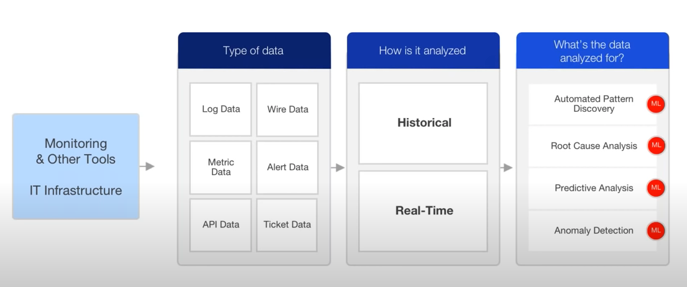

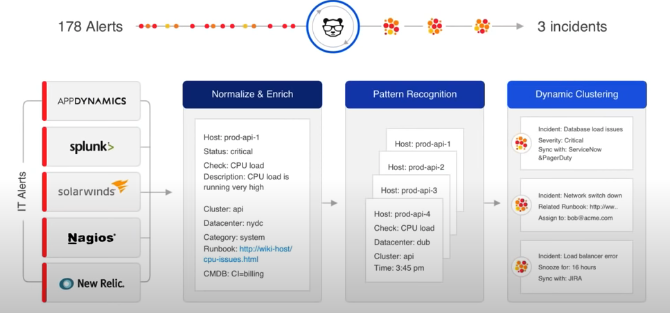

- Pattern Recognition:
    - Leverage various unsupervised machine learning techniques.
    - Cluster all the related information together.
    - 
    
- Can you get insights from both **Streaming** and **Historical** data?

- What is the root cause of the performance issue? 
- What is its business impact?
- Amoung all the suspected root cause what is the top priority to investigate?

*Event correlation and RCA analysis*: This is done by us focusing on *pattern detection* and *anamoly detection* and *causality* of this layer.

## Automated Root Cause Analysis
When an issue occurs, this UI provides the user a hollistic view of the current situation. So we are talking about bringing here *relevant* data in terms of providing unified visibility to the problem. Provide all the relevant and correlated *context*. That is events, alerts and suspected root cause.

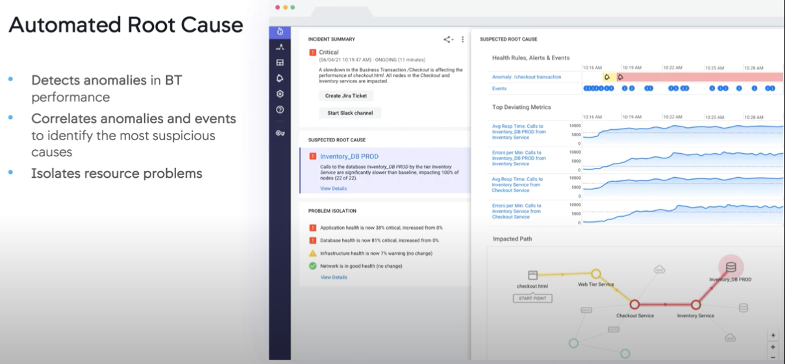

For example, if you take all these events here at the bottom, if some of those events are about the fact that the service was rebooted or upgraded a few minutes *prior* to actually when the performance degradation started, it provides us very good insights into where can the problem lies. 

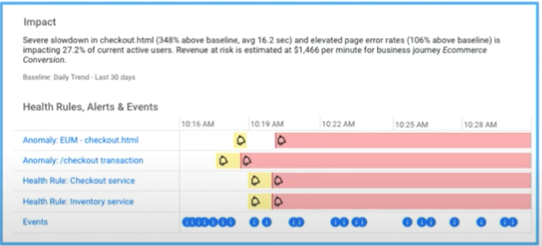

Automated Root Cause Analysis:
- Detect anamolies in app/infra components
- Correlate anamolies and events to identify the most suspicious causes.
- Isolate the resources which are impacted. (Impact Path).

So, what is required?
- Baseline all the metrics associated with that application (Morcom Trading). 
    - Pick one app, pull all the (app/infra) metrics and determine what is the baseline. Could be rolling averages + risk patterns.
- Next, detect anamolies when any application/infra component's performance starts *degrading*.
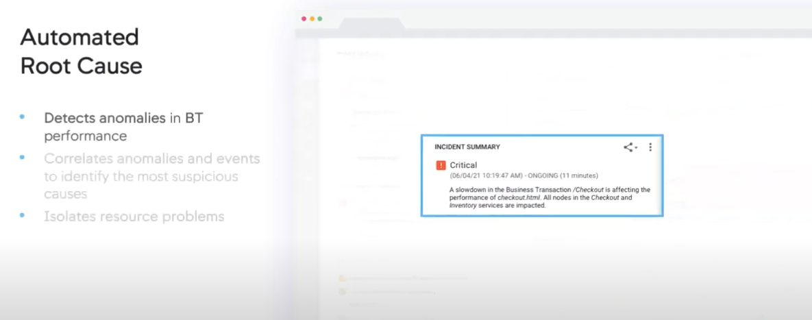
- It then **correlates** those `anamolies` and `events` to identify the most suspicious causes. 
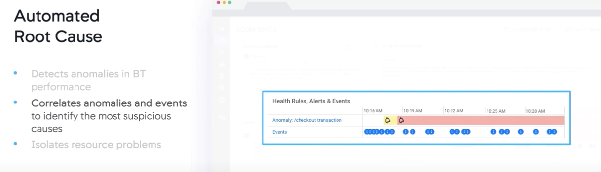
- Finally, isolate the problematic resource, whether those are *deviating metrics*, *calls to database*, *errors per minute*, *responsiveness*.
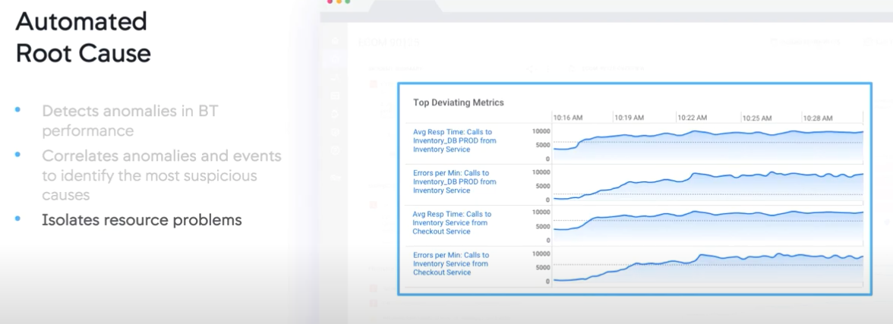

The first step to really isolating those resources is to identify the faulty domain - this could be a third-party application, another service that you are using, or a remote service, or could be the network/database, or it could be the application itself, and when it is within the application, then we can actually drill-down using additional capabilities. 

### RCA to trigger actions
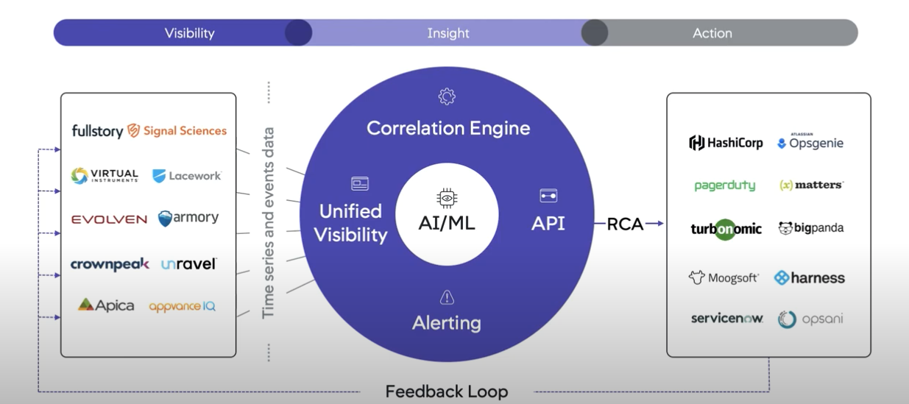

## Approach2:
- Correlation means figuring out what else went wrong in a given time-window, outside the scope of 1 application or server. To do this, you'd have to extract the interesting entities from the logs like an ip address/username/id and search for this entity in other applications. 

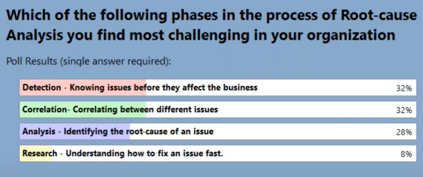

What capabilites are a must?
- Collect + Preprocess the data. Break it down to meaningful components. 
- Learn the Baselines and *detect* that there is a problem. (*This might already be in place in most organizations: email alerts, process monitoring alerts/emails etc*). Be able to track every metric's threshold and be able to detect *deviations* automatically.
- Now, after something has been detected, you want to look for *correlations* - which means, looking for other things happening at the same time and to *isolate* the cause that might be *accountable* for the incident/issue/deviation. 
- Lastly, enrich with insights/actions. 

**1. Detecting the problem:** 

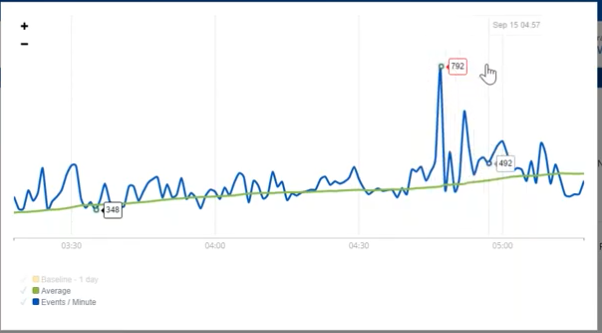

## Approach 3:
- Bringing together application monitoring tools and system monitoring tools and correlating these events to determine the root cause.
- Logically group these alerts to give you true actionable insights.
- 

## What is AIOps?

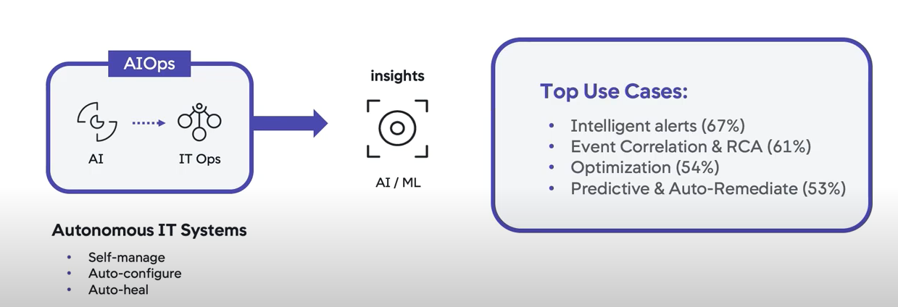

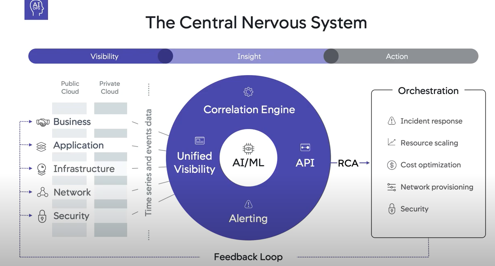

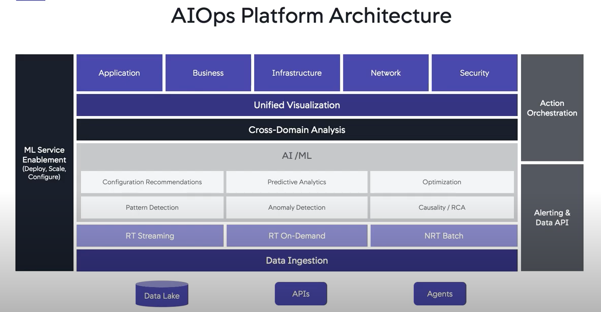

Focus on AI/ML

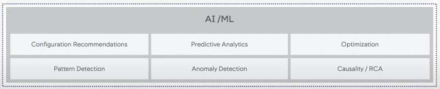

**Key Functions of AIOps**:

In 2018, Gartner outlined the key functions of an AIOps platform as:

- Ingesting data from multiple sources regardless of type or vendor
- Executing real-time analysis at the point of ingestion
- Performing historical analysis of stored data
- Making use of machine learning
- Initiating an action or next step based on analytics

## Event Correlation Engine
The goal of event correlation is to identify all events related to a single problem.

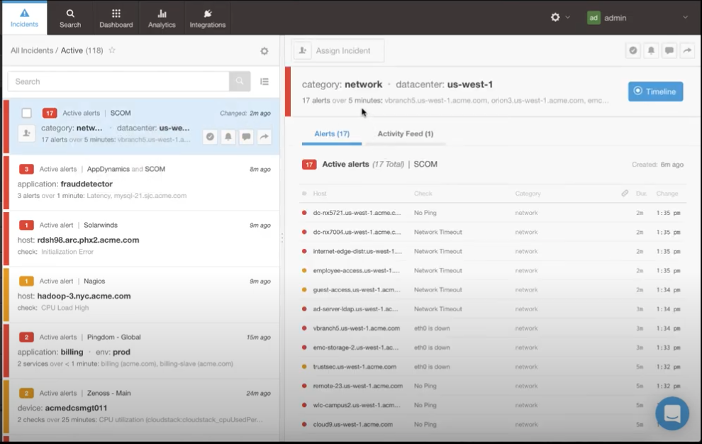

## Event Correlation approaches and techniques
**What is Event Correlation?**: 

> As AIOps matures, event correlation will offer **pattern-based prediction** and the **detection of root causes** that people miss. *AI-driven event correlation solutions* will simply plug in and tell incident managers what to do and how to do it.

Event correlation techniques focus on finding relationships in event data and identifying causation by looking at **characteristics of events** such as: 
- when they occurred, 
- where they occurred, 
- the processes involved, and 
- the data type.

AI-enhanced algorithms play a large role today in spotting those patterns and relationships as well as **pinpointing the source of problems**. 

1. **Time-Based Event Correlation**: This technique looks for relationships in the timing and sequence of events by examining what happened right before or at the same time as an event. You can set a time range or latency condition for correlation.

2. **Rule-Based Event Correlation**: This approach compares events to a rule with specific values for variables such as transaction type or customer city. Because of the need to write a new rule for each variable (New York, Boston, Atlanta, etc.), this can be a time-consuming approach, and unsustainable over the long-term.

3. **Pattern-Based Event Correlation**: This combines the time-based and rule-based techniques by looking for events that match a defined pattern without needing to specify values for each variable. Pattern-based is much less cumbersome than the rule-based technique but *requires machine-learning enhancement of the event correlation tool*. ***Machine learning helps the correlation tool continuously expand its knowledge of new patterns.***

4. **Topology-Based Event Correlation**: This approach is based on network topology, meaning the physical and logical arrangement of hardware such as servers and hubs, nodes on a network, and an understanding of how they’re connected to each other. By mapping events to the topology of affected nodes or applications, this technique makes it easier for users to visualize incidents in the context of their topology.

5. **Domain-Based Event Correlation**: This technique takes event data from monitoring systems that focus on an aspect of IT operations (network performance, application performance, and computing infrastructure) and correlates the events. Some event correlation tools ingest data from all monitoring tools and do cross-domain or domain-agnostic event correlation.

6. **History-Based Event Correlation**: This method compares new events to historical events to see if they match. In this way, a history-based correlation is similar to pattern-based. However, history-based correlation is “dumb” in that it can only connect events by comparing them to identical events in the past. Pattern-based is flexible and evolving.

## Why should we do Event Correlation?
The right event correlation software improves an organization’s resilience and moves it out of a firefighting, purely reactive mindset. ***Additional downstream benefits include automating key processes, faster resolution, and smarter root-cause analysis.***

Best-in-class event correlation tools ingest event data, perform de-duplication, identify significant events from noise, analyze root causes, and prioritize IT response based on business objectives. The ability to collect all types of data from all sources helps IT teams breakthrough siloes that limit their ability to see the full picture.

## Where is AI in Event Correlation?
The rise of artificial intelligence has made `event correlation` more powerful by harnessing machine learning and deep learning. With these, exposing the system to large amounts of data improves correlation algorithms automatically rather than requiring algorithms to be trained manually, over many months or even years. (**Unsupervised Learning**). 

### Event correlation in AIOps
Machine learning and deep learning have given event correlation solutions the power to learn from event data to automatically generate new correlation patterns.

### Gartner's recommendations
Gartner’s analysts recommended that companies take an incremental approach to AIOps. They should start with less critical applications and event categorization, correlation, and anomaly detection. Over time, they can use tools to reduce false alarms, test the value of patterns, become proactive in preventing impact, decrease outage duration, and improve IT service management.

### What challenges do IT ops teams face today?
Does the following sound familiar? 

You have a complex, hybrid and dynamic IT stack – with your cloud infrastructure changing by the minute and your container infrastructure changing by the second. Your monitoring and observability tools provide excellent visibility into your infrastructure, your applications and your services, but the dynamic environment in which they operate causes them to generate large volumes of heterogeneous machine data, with thousands of alerts a minute.  You are working hard to sift through these alerts, trying to detect, analyze, escalate and resolve outages affecting your applications and related services – relying on ServiceNow’s ITSM suite, including its CMDB and ticketing, to help you do so. 

You’re likely doing this in one of two ways: 

(a) by manually creating tickets – which, as we know, can be a laborious, inefficient and error-prone process, or

(b) by using ServiceNow’s built-in ITOM Event Management module (or other automatic ticket creation tools) to aggregate and correlate alerts into incidents, and then automatically create tickets. While this approach is obviously better, it just eliminates the manual effort associated with creating tickets, and you’re still faced with a large and unmanageable number of them.

Another major obstacle you face when using your ServiceNow deployment with your modern IT stack is its ability – or lack thereof – to match your incidents to the changes that caused them. That’s because ServiceNow’s change management module was originally built for the slow, planned and manual release cycles of the previous decade. Back then, If an incident or an outage was caused by a change being tracked in ServiceNow, it wasn’t hard to look at ServiceNow and identify the offending change. 

Today your teams are embracing continuous delivery, pushing code changes to production hundreds of times a day using tools like Jenkins, GitLab and Bamboo. This makes it difficult to track them inside ServiceNow change management, and to identify which of them caused an incident. And with changes causing the majority of incidents today (85% according to Gartner*), you find yourself in a tight spot more often than not. 

If all this sounds like what you and your IT Ops teams experience every day, you’re not alone.

## Considering Algorithms
Clustering and correlation is the most complex and crucial step for AIOps, requiring multiple different approaches. A combination of historical pattern matching and real-time identification helps IT ops teams to identify both recurring and net-new issues.

## Problem Statement and motivation

It is usually very complicated and often requires many people with many different skills – all trying to tackle an incident to determine what happened, when, why, how and ultimately who (to blame).

Since the majority of issues and outages today are caused by changes to infrastructure and software (over 80% according to Gartner), theoretically you only need to find out what changed in order to resolve the incident quickly.

**Changes happen often thesedays**: The problem is that finding these changes is not easy. In today’s fast-moving IT, the number and frequency of changes have skyrocketed. Some of our customers report over 4000 changes every week. These changes cover almost everything we do: deployments, software upgrades, configuration changes, scaling and more. They are manifested in many different tools, so visibility is a problem, and to make matters worse, many of these changes happen either automatically or by mistake, without us knowing about them. 

That is why having an automated RCA is such an important feature. We need a tool that automatically analyzes the information collected from all the `change tools`, including `CI/CD tools`, and **correlates it to all the monitoring alerts collected**, to quickly identify root cause changes and enable immediate resolution. 

## AIOps + ServiceNow

**Goal**: Prevent and resolve *outages* in today's fast-moving IT stacks.

1. AIOps enables ServiceNow ticket reduction and automation.

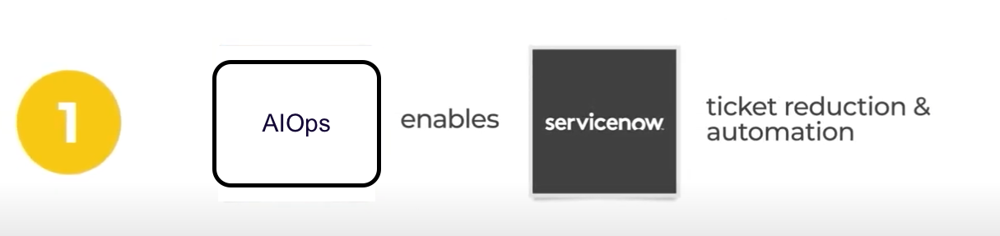

2. When operating your IT Stack, your observability and monitoring tools provide excellent *visibility* into your infrastructure and applications. **BUT** they also create tens of thousands of hetrogeneous **events/alerts** 

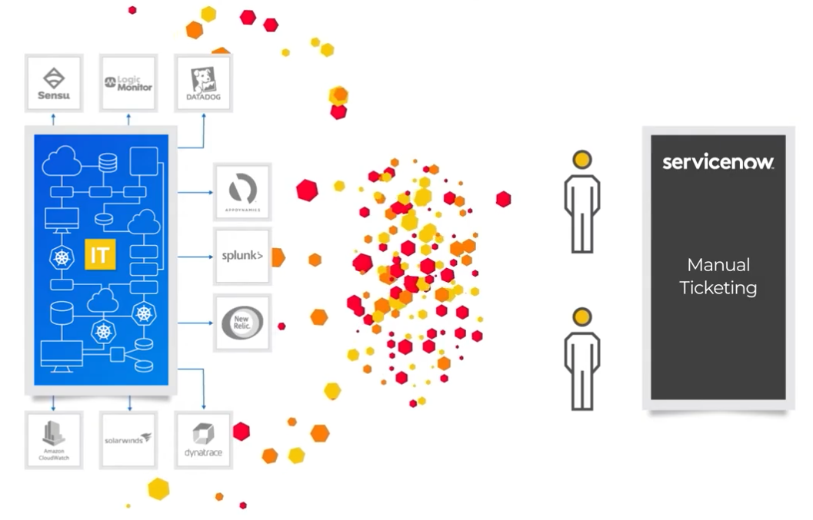

> Your team can *manually* create tickets from these alerts (which is unreasonable), and it is a slow and error prone process. People will go insane if they have to do this manually by checking each alert/email/event and deciding whether to create a ticket or not.

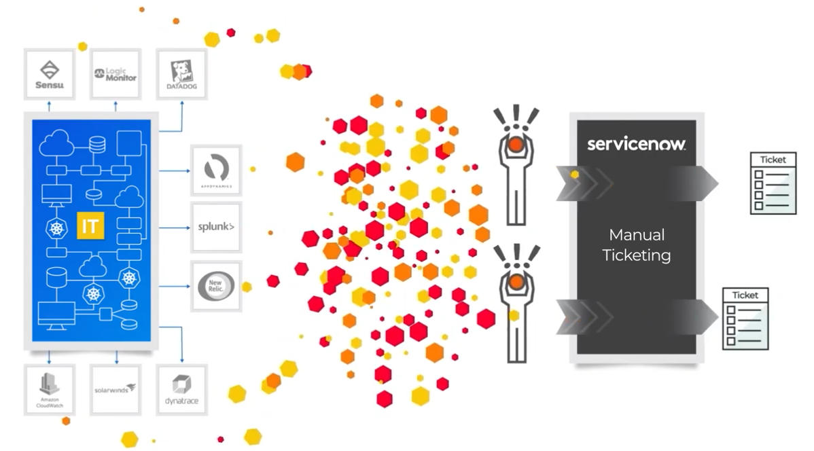

*Alternatively*, you could use *ServiceNow* EventManagement solution (OR) other automatic ticket creating systems (like netcool). While this *can* eliminate the manual effort associated with creating tickets, you are faced with another problem now. You will now have a *large and unmanagable ticket volume*. 

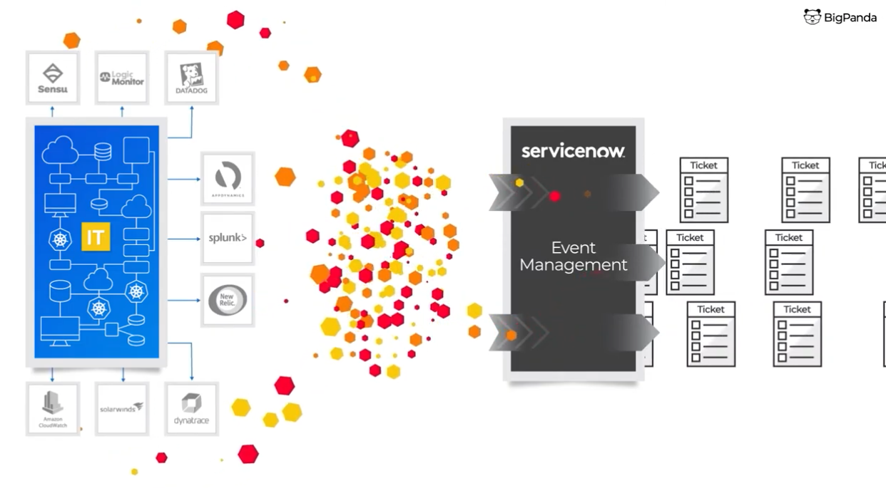

**ENTER AIOps** and specifically *event correlation* - which leverages ML to **correlate** thousands of monitoring alerts into 

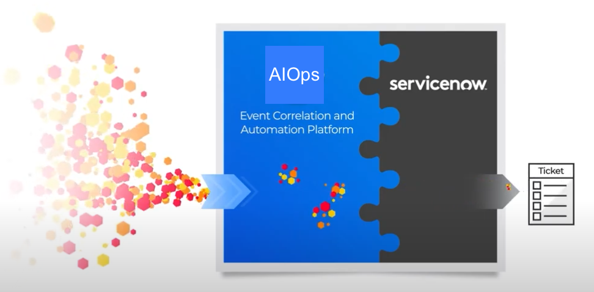
